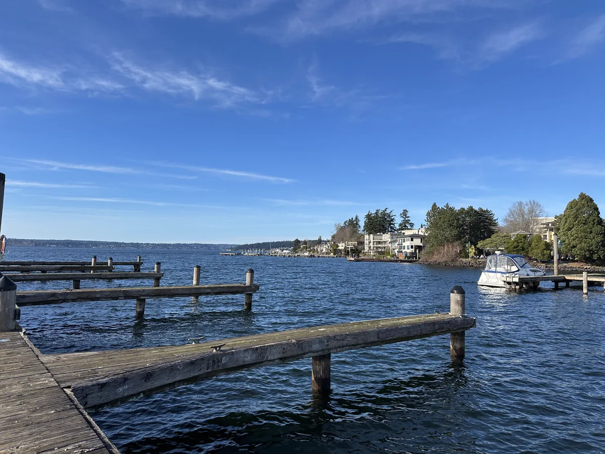
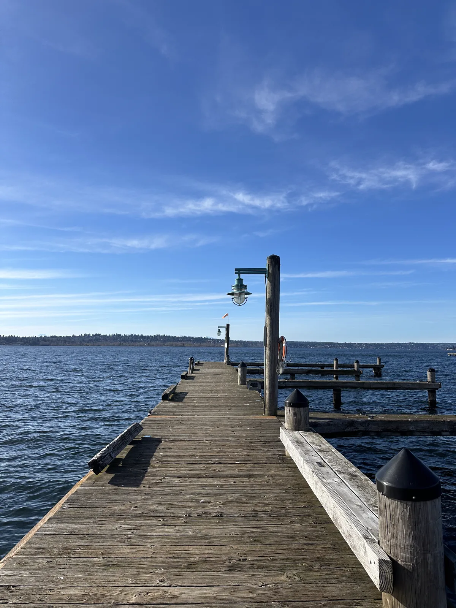
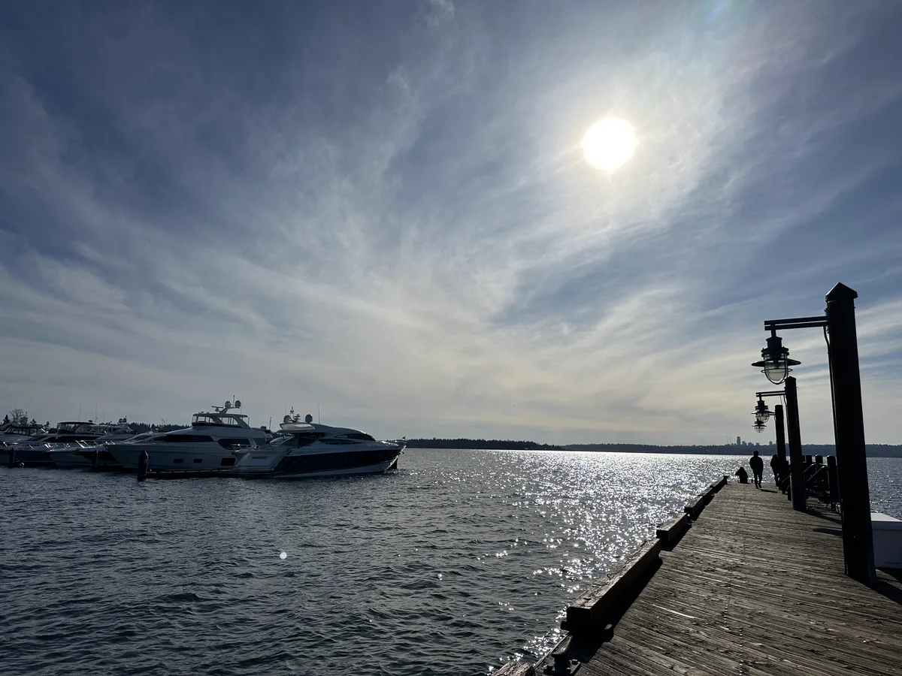
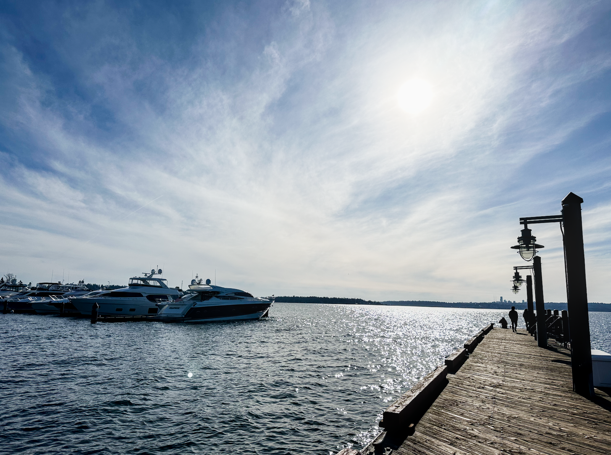

# 寒冬的結尾

這星期天氣都很好，今天到了湖邊走一圈，看著這樣的天，就知道又成功度過了一個冬季，最美好的時光不遠了，隨手拿手機拍一拍[^1]就很漂亮。這個夏天，要在好多地方度過，讓現在每個週末變成旅行社員工，一個接著一個規劃。

湖畔的房子。

望向北方。

望向西方，拍到太陽了反而變得很暗。

試試看 darktable 把曝光調了 +1 EV，這是一個可以直接改變全部像素的設定？

[^1]: `mogrify -format webp -resize 1200x -strip -quality 82 *.heic`
